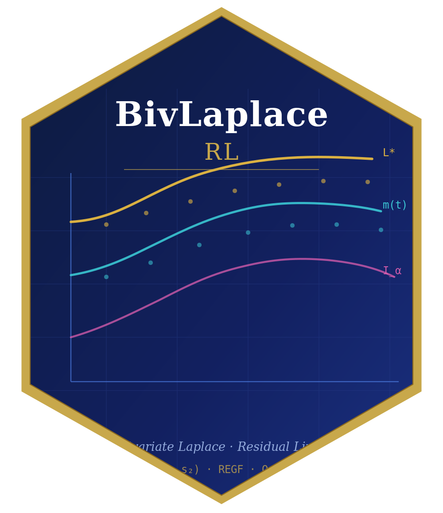

# BivLaplaceRL 

<!-- badges: start -->
[](https://CRAN.R-project.org/package=BivLaplaceRL)
[](https://github.com/itsmdivakaran/BivLaplaceRL/actions/workflows/R-CMD-check.yaml)
[](https://app.codecov.io/gh/itsmdivakaran/BivLaplaceRL?branch=main)
[](https://www.gnu.org/licenses/gpl-3.0)
<!-- badges: end -->

**BivLaplaceRL** is an R package for bivariate and univariate Laplace transforms
of residual lives, stochastic ordering concepts, and entropy measures in
reliability analysis.

<div class="feature-row">

<div class="feature-card">
<h4>Residual Life Analysis</h4>
<p>Bivariate Laplace transforms of residual lives — closed-form Gumbel results,
general numerical integration, nonparametric estimation, and NBUHR/NWUHR aging
class characterisation.</p>
</div>

<div class="feature-card">
<h4>Reversed Residual Lives</h4>
<p>BLt-Rrl framework: reversed hazard gradient, reversed mean residual life, and
closed-form transforms for FGM and bivariate power distributions.</p>
</div>

<div class="feature-card">
<h4>Univariate Methods</h4>
<p>Univariate LT of residual life, hazard rate, mean residual life, and three
stochastic orders (Lt-rl, hazard rate, MRL) with nonparametric estimation.</p>
</div>

<div class="feature-card">
<h4>Stochastic Orders</h4>
<p>Seven bivariate and three univariate stochastic order checks, each returning
a logical flag and supporting diagnostic values.</p>
</div>

</div>

## Research Basis

| Paper | Journal | Authors |
|-------|---------|---------|
| Bivariate Laplace transform of residual lives and their properties | *Communications in Statistics — Theory and Methods* (2022) | Jayalekshmi S., Rajesh G., Nair N.U. |
| Bivariate Laplace transform order and ordering of reversed residual lives | *Int. J. Reliability, Quality and Safety Engineering* | Jayalekshmi S., Rajesh G. |

## Features

### Parametric Distributions
- Gumbel bivariate exponential (`dgumbel_biv`, `sgumbel_biv`, `rgumbel_biv`, `pgumbel_biv`)
- Farlie-Gumbel-Morgenstern — FGM (`dfgm_biv`, `pfgm_biv`, `sfgm_biv`, `rfgm_biv`)
- Bivariate power distribution (`dbivpower`, `pbivpower`, `sbivpower`, `rbivpower`)
- Schur-constant distribution (`sschur_biv`, `rschur_biv`)

### Bivariate Laplace Transform of Residual Lives
- `blt_residual()` — numerical computation for any survival function
- `blt_residual_gumbel()` — closed-form for Gumbel distribution
- `biv_hazard_gradient()` — bivariate hazard gradient
- `biv_mean_residual()` — bivariate mean residual life
- `nbuhr_test()` — NBUHR/NWUHR aging class test
- `np_blt_residual()` — nonparametric estimator
- `sim_blt_residual()` — Monte-Carlo simulation study

### Bivariate Laplace Transform of Reversed Residual Lives
- `blt_reversed()` — for any joint CDF
- `blt_reversed_fgm()` — closed form for FGM
- `blt_reversed_power()` — for bivariate power distribution
- `biv_rhazard_gradient()` — reversed hazard gradient
- `biv_rmrl()` — reversed mean residual life

### Univariate Residual Life Analysis
- `lt_residual()` — LT of residual life: E[e^{-sX} | X > t]
- `hazard_rate()` — hazard rate h(t) = f(t)/S(t)
- `mean_residual()` — mean residual life m(t) = E[X-t | X>t]
- `np_lt_residual()` — nonparametric estimator

### Stochastic Orders (Bivariate)
- `blt_order_residual()` — BLt-rl order
- `blt_order_reversed()` — BLt-Rrl order
- `biv_whr_order()` — weak bivariate hazard rate order
- `biv_wmrl_order()` — weak bivariate MRL order
- `biv_brlmr_order()` — bivariate relative MRL order
- `biv_wrhr_order()` — weak bivariate reversed hazard rate order
- `biv_wrmrl_order()` — weak bivariate reversed MRL order

### Stochastic Orders (Univariate)
- `lt_rl_order()` — Lt-rl order: L_X(s,t) ≤ L_Y(s,t) for all s, t
- `hr_order()` — hazard rate order: h_X(t) ≤ h_Y(t) for all t
- `mrl_order()` — MRL order: m_X(t) ≤ m_Y(t) for all t

### Entropy Measures
- `shannon_entropy()` — Shannon differential entropy
- `info_gen_function()` — Golomb information generating function

### Plotting
- `plot_blt_residual()`, `plot_blt_reversed()`

## Installation

```r
# Install from CRAN
install.packages("BivLaplaceRL")
```

```r
# Development version from GitHub
# install.packages("devtools")
devtools::install_github("itsmdivakaran/BivLaplaceRL")
```

## Quick Start

```r
library(BivLaplaceRL)

# 1. Simulate from Gumbel bivariate exponential
set.seed(42)
dat <- rgumbel_biv(500, k1 = 1, k2 = 1, theta = 0.5)

# 2. Nonparametric estimate of BLT of residual lives
np_blt_residual(dat, s1 = 1, s2 = 1, t1 = 0.3, t2 = 0.3)

# 3. Compare with closed-form
blt_residual_gumbel(s1 = 1, s2 = 1, t1 = 0.3, t2 = 0.3, k1 = 1, k2 = 1, theta = 0.5)

# 4. Univariate LT of residual life for Exp(1)
f  <- function(x) dexp(x, 1)
Fb <- function(x) pexp(x, 1, lower.tail = FALSE)
lt_residual(f, Fb, s = 1, t = 0.5)

# 5. Hazard rate and MRL
hazard_rate(f, Fb, t = c(0.5, 1, 2))
mean_residual(Fb, t = c(0, 0.5, 1, 2))

# 6. Check univariate stochastic orders: Exp(2) <=_hr Exp(1)?
f2  <- function(x) dexp(x, 2)
Fb2 <- function(x) pexp(x, 2, lower.tail = FALSE)
hr_order(f2, Fb2, f, Fb, t_grid = c(0.5, 1, 2))$order_holds
```

## Authors

**Mahesh Divakaran** (maintainer)
Research Scholar, Amity School of Applied Sciences, Amity University Lucknow
imaheshdivakaran@gmail.com

**S. Jayalekshmi**, **G. Rajesh**, **N. Unnikrishnan Nair**
Department of Statistics, Cochin University of Science and Technology

## References

Jayalekshmi S., Rajesh G., Nair N.U. (2022). Bivariate Laplace transform of
residual lives and their properties. *Communications in Statistics — Theory and
Methods*. <https://doi.org/10.1080/03610926.2022.2085874>

Jayalekshmi S., Rajesh G. Bivariate Laplace transform order and ordering of
reversed residual lives. *International Journal of Reliability, Quality and
Safety Engineering*. <https://doi.org/10.1142/S0218539322500061>

Belzunce F., Ortega E., Ruiz J.M. (1999). The Laplace order and ordering of
residual lives. *Statistics & Probability Letters*, 42(2), 145--156. 
<https://doi.org/10.1016/S0167-7152(98)00202-8>

## License

GPL-3 © 2024 Mahesh Divakaran
